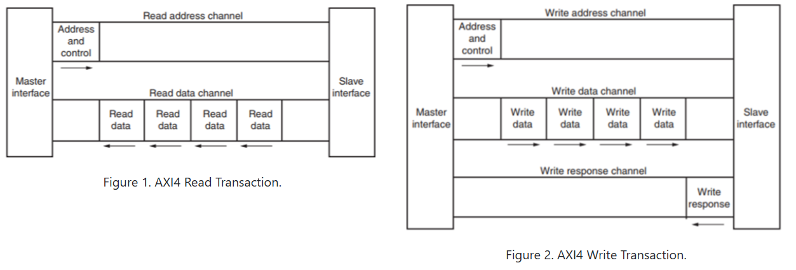

# AXI4 Slave Design and Verification (SystemVerilog)

## Overview
This project implements an **AXI4-compliant Slave** in **SystemVerilog**, verified using a **class-based self-checking testbench**.  
The design follows the **ARM AMBA AXI4 Protocol Specification** and supports **FIXED, INCR, and WRAP burst modes** for both **read and write transactions**.

Simulation and verification were performed using **Xilinx Vivado**.

---

## AXI4 Read and Write Transactions

---

## AXI4 Read Transaction
The AXI4 read operation is divided into **two independent channels**, enabling pipelined data transfers:

### Read Address Channel (AR)
- Transfers read address and control information from master to slave
- Handshake using `ARVALID` and `ARREADY`

### Read Data Channel (R)
- Slave returns read data beats
- Burst transfers supported
- `RLAST` indicates the final beat of a burst
- `RRESP` provides read response status

---

## AXI4 Write Transaction
The AXI4 write operation is divided into **three independent channels**:

### Write Address Channel (AW)
- Transfers write address and burst control information

### Write Data Channel (W)
- Transfers write data in multiple beats
- Byte-lane masking supported using `WSTRB`
- `WLAST` marks the final data beat

### Write Response Channel (B)
- Slave returns write completion status
- `BRESP` indicates success or error
- `BID` returns the transaction ID

---

## Design Features
- AXI4 read and write channel implementation
- Support for FIXED, INCR, and WRAP burst types
- Byte-level write masking using `WSTRB`
- Response handling as defined by AXI4:
  - OKAY
  - SLVERR
  - DECERR
- Independent FSMs for all AXI channels
- Internal byte-addressable memory

---

## Design Details

### RTL Design (`axi4.sv`)
- AXI4 interface and slave implemented in SystemVerilog
- Separate FSMs for:
  - Write Address Channel
  - Write Data Channel
  - Write Response Channel
  - Read Address Channel
  - Read Data Channel
- Burst address generation implemented using dedicated functions for:
  - FIXED bursts
  - INCR bursts
  - WRAP bursts
- Wrap boundary calculation based on burst length and transfer size, as per AXI4 specification

### Verification Testbench (`tb.sv`)
- Class-based SystemVerilog testbench
- Components:
  - Generator
  - Driver
  - Monitor
  - Scoreboard
- Mailbox-based communication
- Event-based synchronization
- Automatic data checking for read-after-write verification

---

## Simulation Environment
- Simulator: **Xilinx Vivado**
- Language: **SystemVerilog**
- Protocol Reference: **ARM AMBA AXI4 Specification**

To simulate:
1. Add `axi4.sv` and `tb.sv` to a Vivado simulation project
2. Set `tb` as the top module
3. Run behavioral simulation
4. View waveforms using Vivado waveform viewer

---

## Author
**Bhakti Sushant Prabhu Dessai**  
B.Tech ECE – NIT Goa
